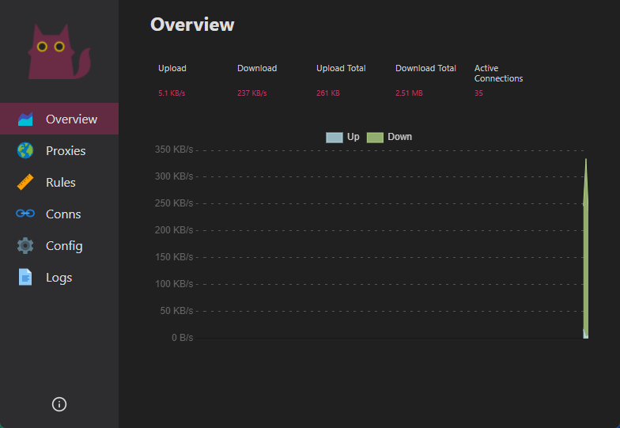

<h1 align="center">
  
</h1>

>  [Dashboard](https://github.com/Dreamacro/clash-dashboard) For Kennel [Clash.Meta](https://github.com/clash-mini/clash.meta)

### Display Process name


Clash add field Process to Metadata and prepare to get process name for Restful API GET /connections.


## Development

```sh
# install dependencies
yarn

# start the dev server
# then go to http://127.0.0.1:3000
yarn start


# build optimized assets
# ready to deploy assets will be in the directory `public`
yarn build
```

## Credits
* ###[Haishanh - YACD](https://github.com/haishanh/yacd)
* ###[yaling888 - Another YACD](https://github.com/yaling888/yacd)